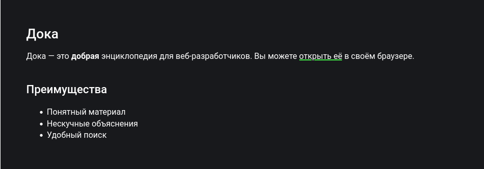

## Кратко
Markdown — удобочитаемый язык разметки, который прозрачно конвертируется в HTML. Его можно открывать и изменять в любом редакторе текста. Широко используется для написания документаций и README-файлов.

## Пример

```
# Дока

Дока — это **добрая** энциклопедия для веб-разработчиков.
Вы можете [открыть её](https://doka.guide) в своём браузере.

## Преимущества

- Понятный материал;
- Нескучные объяснения;
- Удобный поиск.
```

Он содержит базовые элементы, которые можно найти почти в любом README.md:

    заголовок первого уровня для названия;
    выделение жирным шрифтом важных частей в описании;
    ссылка с понятным текстом;
    заголовок второго уровня для подпунктов;
    маркированный список для перечисления преимуществ.

Несмотря на то, что Markdown достаточно удобно читать в исходном виде, его часто переводят в HTML. Результат конвертации находится ниже.



## Синтаксис
Параграф

Параграф — это одна или несколько подряд идущих строчек текста, отделённых одной или несколькими пустыми строчками. Если строка содержит только пробелы или табы, то она всё равно считается пустой.

Подряд идущие строчки будут склеены в одну, если не добавить жёсткий перенос. Существует несколько способов, как это можно сделать:

    добавить два (или больше) пробелов в конце строки <пробел><пробел>;
    добавить обратную косую черту в конце строки \;
    добавить HTML-тег переноса строки <br>.

```
Привет,
мир!

Привет,<пробел><пробел>
пробел!

Привет,\
косая черта!

Привет,<br>
тег бр-р-р!
```

## Заголовки
Markdown предлагает два стиля написания заголовков: через решётки (#) и через подчёркивания (====). Можно использовать до шести уровней заголовков, но подчёркивания позволяют создавать только первые два (\<h1\> и \<h2\>).
Решётки (Atx-style)

Для того чтобы выделить заголовок, необходимо поставить от 1 до 6 решёток (#) и пробел в самом начале строки. Уровень заголовка зависит только от количества решёток.

```
# Заголовок 1 уровня
## Заголовок 2 уровня
### Заголовок 3 уровня
#### Заголовок 4 уровня
##### Заголовок 5 уровня
###### Заголовок 6 уровня
```


